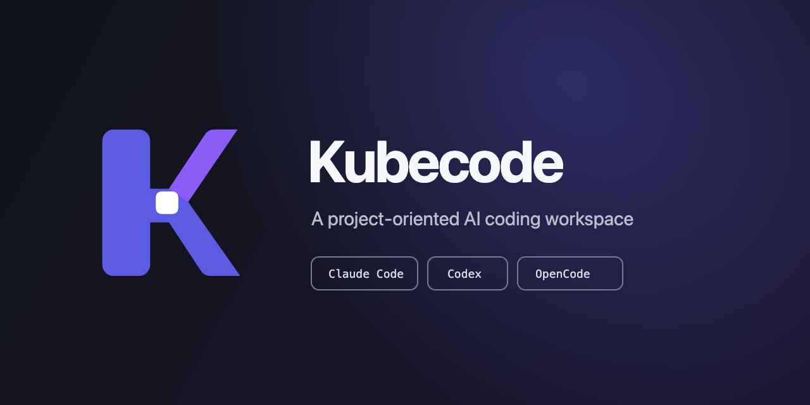
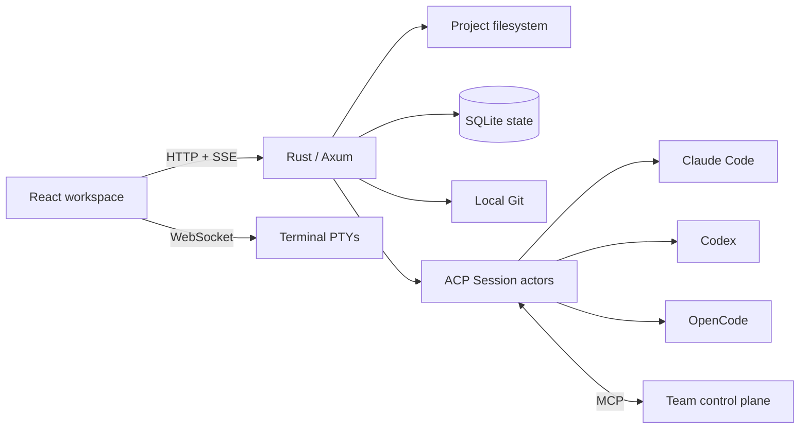

<p align="center">
  
</p>

<h1 align="center">Kubecode</h1>

<p align="center">
  A self-hosted, project-oriented AI coding workspace.
</p>

<p align="center">
  <a href="./README.md">English</a> ·
  <a href="./README.zh-CN.md">简体中文</a>
</p>

<p align="center">
  <a href="https://github.com/Bayes-Cluster/kubecode/actions/workflows/ci.yml"></a>
  <a href="./LICENSE"></a>
</p>

<p align="center">
  
</p>

Kubecode turns a directory on a Linux machine into a durable AI coding
workspace. Run local coding agents, keep long-lived Sessions, coordinate Agent
Teams, inspect Git changes, edit files, and manage reconnectable terminals
without leaving the browser.

Kubecode currently supports these local Agent CLIs:

- [Claude Code](https://docs.anthropic.com/en/docs/claude-code)
- [Codex](https://developers.openai.com/codex/cli)
- [OpenCode](https://opencode.ai)

Authentication, model selection, and provider credentials remain owned by each
CLI. Kubecode discovers local executables and communicates with them through
ACP; it does not proxy prompts through a hosted model service.

## Why Kubecode

| AI Sessions | Team workflows | Complete workspace |
| --- | --- | --- |
| Durable ACP conversations with native modes, models, commands, plans, permissions, questions, resume, and fork when supported. | A fixed Leader coordinates independent teammates, durable tasks, mailbox delivery, permission review, and optional independent verification. | Project files, CodeMirror editing, Git changes, diffs, shell or Agent TUI terminals, free-form splits, themes, and notifications. |

## Workspace model

- **Project** — an absolute, canonical directory registered on the Kubecode
  server.
- **Session** — a durable conversation connected to one local Agent and one
  Project.
- **Team** — a Leader-governed group of independent Agent Sessions with
  persistent tasks and messages.
- **Terminal** — a reconnectable shell or native Agent TUI PTY.

Deleting a Project only unregisters it. Deleting a Session removes only
Kubecode's local record. Kubecode never deletes the Project directory or
provider-native Session history.

## Quick start

### Requirements

- Linux amd64 or arm64 with glibc 2.28 or newer
- Git
- at least one installed and authenticated supported Agent CLI

```bash
curl -fsSL https://raw.githubusercontent.com/Bayes-Cluster/kubecode/main/install.sh | sh
~/.local/bin/kubecode
```

Open <http://127.0.0.1:8888>. The standalone release bundles the web
application, Rust server, Node.js runtime, and Claude/Codex ACP adapters. Agent
CLIs and their credentials remain on the host.

On Debian or Ubuntu, download the package for the machine architecture from
GitHub Releases and install it with:

```bash
sudo apt install ./kubecode_0.1.1_amd64.deb
kubecode
```

The Debian package installs the same standalone runtime and does not enable a
service.

To install a fixed version or preview the operation:

```bash
./install.sh --version 0.1.1
./install.sh --version 0.1.1 --dry-run
```

See [Installation](docs/guides/installation.md) for manual archive installation,
server options, persistent state, Agent discovery, and source development.

## Source development

```bash
pnpm install
pnpm dev:server
```

In a second terminal:

```bash
pnpm dev
```

Open <http://127.0.0.1:5202>. Source development requires Node.js 22+, pnpm 10,
and stable Rust. Local development state is stored under `.local/`.

## Architecture



The Rust server is the trust boundary. Browser requests use Project IDs and
validated relative paths; filesystem access stays inside registered Project
roots.

## Documentation

### User guide

- [Documentation home](docs/README.md)
- [Installation](docs/guides/installation.md)
- [Projects, files, and Git](docs/guides/projects-and-files.md)
- [Agent Sessions](docs/guides/agent-sessions.md)
- [Team Sessions](docs/guides/team-sessions.md)
- [Terminal and TUI Sessions](docs/guides/terminal.md)
- [Configuration](docs/guides/configuration.md)
- [Troubleshooting](docs/guides/troubleshooting.md)

### Developer documentation

- [Architecture](docs/ARCHITECTURE.md)
- [Core abstractions](docs/ABSTRACTIONS.md)
- [Architecture Decision Records](docs/adr/README.md)
- [Contributing](CONTRIBUTING.md)
- [Security policy](SECURITY.md)

## Repository layout

```text
src/kubecode/    Browser workspace and API client
src/components/  Shared UI and Agent transcript primitives
server/          Axum API, ACP runtime, terminal, Git, and workspace services
packaging/       Standalone, ACP adapter, and Debian package metadata
scripts/         Build, install, validation, and smoke-test tooling
tests/smoke/     Browser workspace smoke tests
docs/            User, developer, and architecture documentation
```

## Quality checks

```bash
pnpm lint
npx tsc --noEmit
pnpm test
pnpm test:coverage
pnpm test:packages
cargo test --manifest-path server/Cargo.toml
cargo clippy --manifest-path server/Cargo.toml -- -D warnings
cargo fmt --manifest-path server/Cargo.toml -- --check
pnpm playwright:smoke
pnpm docs:check
```

## License and origin

Kubecode is licensed under
[AGPL-3.0-or-later](LICENSE). It began as a derivative of the open-source
Tolaria project and retains attribution through the repository history and
license.
