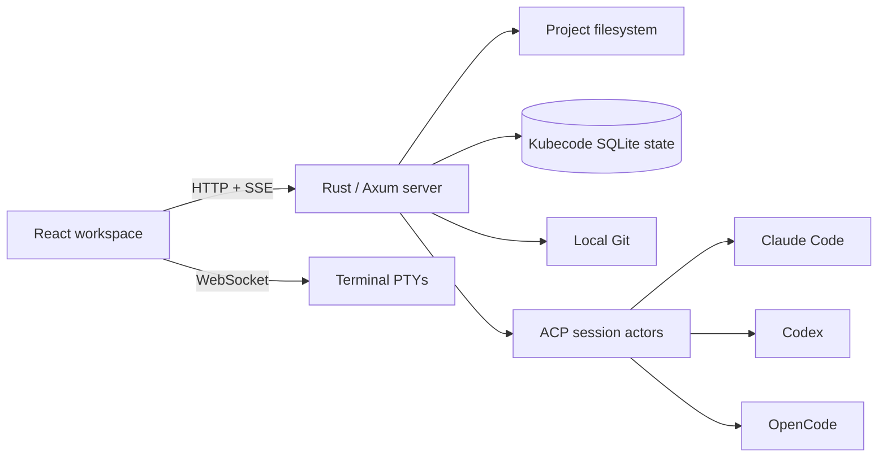

# Kubecode

Kubecode is a project-based AI coding workspace designed to run inside a
single-user Kubeflow Notebook. A project is an absolute directory on the
server. Inside that directory, users can work with long-lived coding-agent
sessions, terminal PTYs, Git changes, a file tree, and a lightweight
CodeMirror editor from one browser workspace.

Kubecode currently supports three local agents:

- Claude Code
- Codex
- OpenCode

The application discovers their local executables at server startup. Agent
authentication, models, and provider configuration remain owned by each CLI.
Kubecode does not store provider API keys or proxy requests through a hosted
model service.

## Workspace model

- **Project** — an absolute, canonical server path registered with Kubecode.
- **Session** — a durable ACP conversation connected to one local agent and
  one project.
- **Terminal** — a reconnectable PTY running either the user's shell or the
  native Claude Code, Codex, or OpenCode TUI.
- **Context panel** — Project files, Git changes, diffs, and CodeMirror editing.

Deleting a Session removes only Kubecode's local session record. Deleting a
Project unregisters it from Kubecode; it never deletes the project directory
or any files below it.

## Features

- Project registration and server-side directory import
- Long-lived ACP sessions with resume, fork, native commands, modes,
  configuration, plans, permissions, and structured questions when supported
  by the selected agent
- Durable Team Sessions with a fixed Leader, independent teammate chats,
  dependency-aware tasks, restart-safe mailbox delivery, inline user decisions,
  and background provider cleanup
- Searchable Session navigation grouped by live status and activity, with
  archive controls and provider-native fork/subagent relationships
- Cross-Project input-required indicators and browser/system notifications for
  completion, attention, and errors
- Reconnectable shell and agent TUI terminals with multiple PTYs and free-form
  horizontal or vertical splits
- Docked Changes and Files trees, file and folder creation, rename, delete,
  diffs, and lightweight CodeMirror editing
- Project-scoped Git status, diff, stage, unstage, discard, init, and commit
- Markdown, syntax highlighting, and LaTeX rendering in agent responses
- Light, dark, and system color schemes with OpenCode-compatible themes and
  independent UI, code, and terminal fonts
- Kubeflow base-path support through `NB_PREFIX`

## Architecture



The Rust server is the trust boundary. The browser sends Project IDs and
relative paths; the server canonicalizes every filesystem operation inside the
registered Project root. Session metadata and normalized Agent events are
stored under `$KUBECODE_STATE_DIR` or `$PERSISTENT_DIR/.state/kubecode`.

See [Architecture](docs/ARCHITECTURE.md),
[Abstractions](docs/ABSTRACTIONS.md), and the active
[ADRs](docs/adr/README.md) for implementation details.

## Local development

### Requirements

- Node.js 22 or newer
- pnpm 10
- Stable Rust
- Git
- At least one supported local agent for AI Session testing

Install dependencies:

```bash
pnpm install
```

Start the API server:

```bash
pnpm dev:server
```

In another terminal, start Vite:

```bash
pnpm dev
```

Open <http://127.0.0.1:5202>. Vite proxies `/api` requests and terminal
WebSockets to the Rust server on port 8888. Local runtime data is written below
`.local/`, which is ignored by Git.

The agent CLIs must be installed and authenticated separately. The Claude and
Codex ACP adapters are installed as project dependencies; OpenCode exposes ACP
natively through `opencode acp`.

Useful executable overrides:

```text
KUBECODE_CLAUDE_PATH
KUBECODE_CODEX_PATH
KUBECODE_OPENCODE_PATH
KUBECODE_CLAUDE_ACP_PATH
KUBECODE_CODEX_ACP_PATH
```

### Production-style local run

```bash
pnpm build
PERSISTENT_DIR="$PWD/.local/workspace" \
KUBECODE_STATE_DIR="$PWD/.local/state" \
KUBECODE_STATIC_DIR="$PWD/dist" \
PORT=8888 \
cargo run --manifest-path server/Cargo.toml
```

Then open <http://127.0.0.1:8888>.

## Container and Kubeflow

Build the production image:

```bash
docker build -f deploy/Dockerfile -t kubecode:local .
```

The image contains the web build, `kubecode-server`, the three supported CLIs,
the Claude and Codex ACP adapters, and s6 process initialization. It runs as the
Notebook user and stores durable state below the mounted `PERSISTENT_DIR`.

[`deploy/kubeflow-notebook.yaml`](deploy/kubeflow-notebook.yaml) provides a
reference PVC and Kubeflow Notebook resource. Replace the image and set
`NB_PREFIX` to the route assigned by your Kubeflow installation.

## Quality checks

```bash
pnpm lint
npx tsc --noEmit
pnpm test
pnpm test:coverage
cargo test --manifest-path server/Cargo.toml
cargo clippy --manifest-path server/Cargo.toml -- -D warnings
cargo fmt --manifest-path server/Cargo.toml -- --check
pnpm playwright:smoke
```

## Repository layout

```text
src/kubecode/    Browser workspace and API client
src/components/  Shared UI, Agent transcript, and shadcn primitives
server/          Axum API, ACP runtime, terminal, Git, and workspace services
deploy/          Container and Kubeflow deployment assets
tests/smoke/     Browser workspace smoke test
docs/            Current architecture and ADRs
```

## License and origin

Kubecode is licensed under AGPL-3.0-or-later. It began as a derivative of the
open-source Tolaria project and retains attribution through the repository
history and license.
