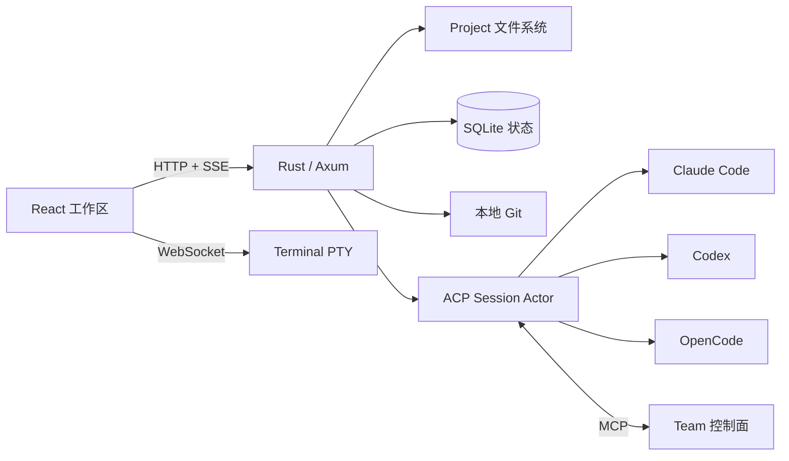

<p align="center">
  
</p>

<h1 align="center">Kubecode</h1>

<p align="center">
  面向 Kubeflow 的项目式 AI 编程工作区。
</p>

<p align="center">
  <a href="./README.md">English</a> ·
  <a href="./README.zh-CN.md">简体中文</a>
</p>

<p align="center">
  <a href="https://github.com/Bayes-Cluster/kubecode/actions/workflows/ci.yml"></a>
  <a href="./LICENSE"></a>
</p>

<p align="center">
  
</p>

Kubecode 将单用户 Kubeflow Notebook 中的目录变成持久化 AI 编程工作区。
用户可以在浏览器中运行本地编程 Agent、维护长连接 Session、组织 Agent
Team、查看 Git 变更、编辑文件，以及管理可重连的终端。

Kubecode 目前支持以下本地 Agent CLI：

- [Claude Code](https://docs.anthropic.com/en/docs/claude-code)
- [Codex](https://developers.openai.com/codex/cli)
- [OpenCode](https://opencode.ai)

认证、模型选择和 Provider 凭据继续由各 CLI 自己管理。Kubecode 发现本地
可执行文件并通过 ACP 与它们通信，不会把 Prompt 转发到托管模型服务。

## 为什么选择 Kubecode

| AI Session | Team 工作流 | 完整工作区 |
| --- | --- | --- |
| 持久化 ACP 对话；在 Agent 支持时使用原生 mode、model、command、plan、permission、question、resume 和 fork。 | 固定 Leader 协调独立 Teammate、持久化任务、Mailbox、权限审查和可选的独立验证。 | Project 文件、CodeMirror 编辑器、Git 变更与 Diff、Shell 或 Agent TUI、自由 Split、Theme 和 Notification。 |

## 工作区模型

- **Project** — 注册到 Kubecode Server 的绝对、规范化目录。
- **Session** — 连接一个本地 Agent 和一个 Project 的持久化对话。
- **Team** — 由 Leader 管理、包含独立 Agent Session、持久化任务和消息的协作组。
- **Terminal** — 可重连的 Shell 或原生 Agent TUI PTY。

删除 Project 只会取消注册。删除 Session 只会移除 Kubecode 的本地记录。
Kubecode 永远不会删除 Project 目录或 Provider 原生 Session 历史。

## 快速开始

### 环境要求

- Node.js 22+
- pnpm 10
- Stable Rust
- Git
- 至少安装并登录一个受支持的 Agent CLI

```bash
pnpm install
pnpm dev:server
```

在第二个终端中运行：

```bash
pnpm dev
```

打开 <http://127.0.0.1:5202>。本地开发数据存放在 `.local/`。

以接近生产环境的方式运行：

```bash
pnpm build
PERSISTENT_DIR="$PWD/.local/workspace" \
KUBECODE_STATE_DIR="$PWD/.local/state" \
KUBECODE_STATIC_DIR="$PWD/dist" \
PORT=8888 \
cargo run --manifest-path server/Cargo.toml
```

## Container 与 Kubeflow

构建生产镜像：

```bash
docker build -f deploy/Dockerfile -t kubecode:local .
```

镜像包含 React 应用、Rust Server、受支持的 Agent CLI、Claude/Codex ACP
Adapter 和 s6 进程初始化。
[`deploy/kubeflow-notebook.yaml`](deploy/kubeflow-notebook.yaml) 是参考
Notebook Manifest；部署时需要替换示例镜像，并根据 Kubeflow 路由配置
`NB_PREFIX`。

持久化存储、运行变量、健康检查和 CLI 配置参见
[安装与部署](docs/zh-CN/guides/installation.md)。

## 架构



Rust Server 是信任边界。浏览器请求使用 Project ID 和经过验证的相对路径；
所有文件系统操作都限制在已注册的 Project Root 内。

## 文档

### 用户指南

- [文档首页](docs/zh-CN/README.md)
- [安装与部署](docs/zh-CN/guides/installation.md)
- [Project、文件与 Git](docs/zh-CN/guides/projects-and-files.md)
- [Agent Session](docs/zh-CN/guides/agent-sessions.md)
- [Team Session](docs/zh-CN/guides/team-sessions.md)
- [Terminal 与 TUI Session](docs/zh-CN/guides/terminal.md)
- [配置](docs/zh-CN/guides/configuration.md)
- [故障排查](docs/zh-CN/guides/troubleshooting.md)

### 开发者文档

- [架构](docs/ARCHITECTURE.md)
- [核心抽象](docs/ABSTRACTIONS.md)
- [架构决策记录](docs/adr/README.md)
- [贡献指南](CONTRIBUTING.md)
- [安全策略](SECURITY.md)

## 仓库结构

```text
src/kubecode/    浏览器工作区与 API Client
src/components/  共享 UI 与 Agent Transcript 组件
server/          Axum API、ACP Runtime、Terminal、Git 与 Workspace Service
deploy/          Container 与 Kubeflow 部署资源
tests/smoke/     浏览器工作区 Smoke Test
docs/            用户、开发者和架构文档
```

## 质量检查

```bash
pnpm lint
npx tsc --noEmit
pnpm test
pnpm test:coverage
cargo test --manifest-path server/Cargo.toml
cargo clippy --manifest-path server/Cargo.toml -- -D warnings
cargo fmt --manifest-path server/Cargo.toml -- --check
pnpm playwright:smoke
pnpm docs:check
```

## 许可证与项目来源

Kubecode 使用 [AGPL-3.0-or-later](LICENSE) 许可证。项目最初基于开源
Tolaria 项目演化而来，相关归属信息保留在仓库历史和许可证中。
